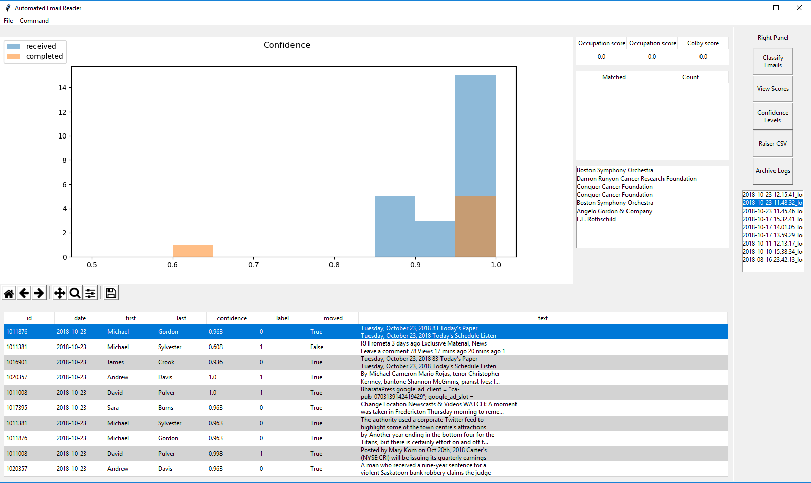

# Automated-Email
> Building a email reader that can classify whether an email is important or not

### Summary

Every day, our department gets over 500 google alerts regarding Colby's alumni. Google alerts are emails that contain links to articles that match the name of our constituents. The task of this project is to build a classifier that can identify whether the person mentioned in the article is affiliated with Colby.

I am currently able to achieve an accuracy of 92% with my model.

The entire process can be broken down into 4 phases: Retrieving the email, scraping the website from the article, classifying the email based on features, and finally displaying it in a Graphical User Interface (GUI).

### Retrieving the Email

To connect Python to Gmail, I used Imaplib. All the methods I used to communicate to my inbox is in the EmailReader.py file

### Web Scraping

To collect the information about each article, I used the packages requests and BeautifulSoup to scrape information off of websites. Because some emails contain multiple links, I treat each link separately, and merge them in the Classification phase. All methods I used to scrape can be found in the scraper.py

### Classification

After retrieving the words from the article,  I devised three scoring metrics: 
- Occupation Score
- Occupation Score Adjusted
- Colby Score. 

### Frontend GUI

I also built a GUI that displays the models:

       

## Future Endeavors

I have been doing personal studies on Natural language processin, which hopefully I can incorporate into this project to increase the accuaracy.

#ChangeLogs

Beta version completed

Version 1.2.0

WINDOWS VERSION

- basic GUI completed
- scoring accuracy of 92%
- features 3 scoring metrics
- original text words part of dataset
- prelim analysis for text data from links, such as length of words, etc

- changed double click to right click that allows user to access links
- added pathlib as a dependency to change the paths from mac to windows
- change naming convention for logs from colons (:) to periods (.)
- Deleted SigAlarm because it doesn't work on windows, need to use threading instead

-FIXED BUG binds not working: set focus AFTER displaying graph

- Changed Scoring Metric: words now have to be at least length 3

Version 1.3.0
10-18-18

WINDOWS VERSION

- decoded email id into string data type
    - this will be encoded back to byte data later
- made constituent id into int data type
- Added option to choose to automate things and the threshold from GUI
